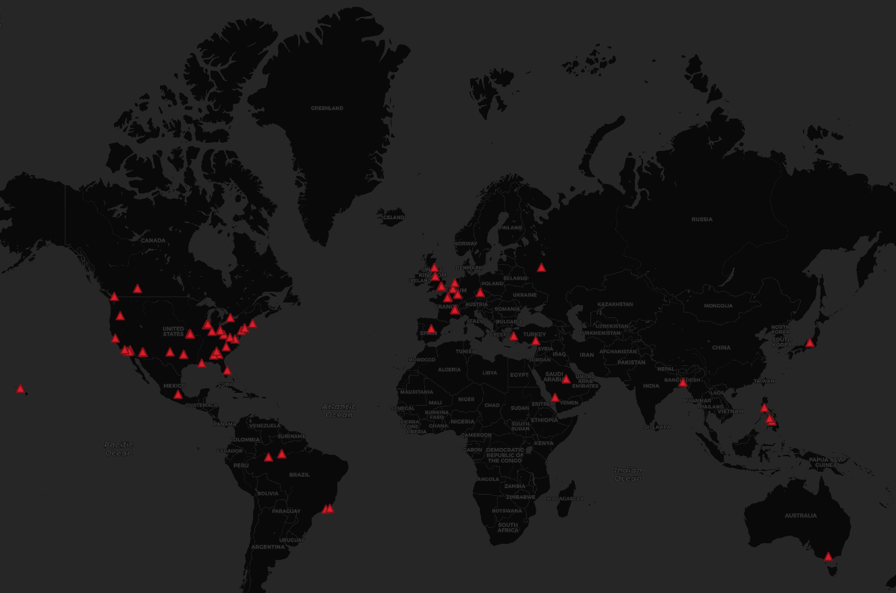

# Geo-tagged-tweet-collection-and-visualization

**Lab2**

Twitter data was retrieved using official Twitter API. A reference to the data crawling tutorial: https://github.com/jakobzhao/geog458/tree/master/labs/lab02

In this project, I used the geographic coordinate filtering tweets of the United States to retrieve. And I added the keyword "First Generation College Student" to filter my data. Through the data visualization, I saw a lot more discussion on this topic in the eastern United States. Although, I haven't been able to find the literature to read, my guess is that people are more interested in this topic in the eastern United States. I also hope I could have other data and information to explore more about: "Are there more First College students in the eastern United States?" in the future.
